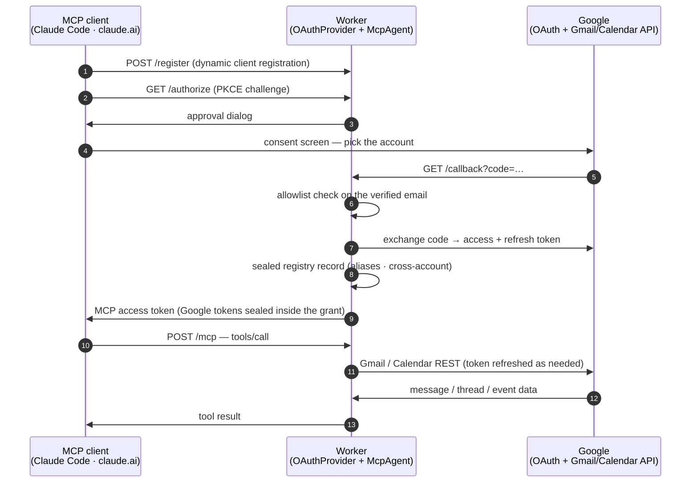

<div align="center">

<picture>
  <source media="(prefers-color-scheme: dark)" srcset="./docs/logo-dark.svg">
  <source media="(prefers-color-scheme: light)" srcset="./docs/logo-light.svg">
  
</picture>

**Gmail and Calendar for your AI assistant — every account at once, on a server you own.**

[](./LICENSE)
[](https://developers.cloudflare.com/workers/)
[](https://modelcontextprotocol.io/)
[](https://datatracker.ietf.org/doc/html/draft-ietf-oauth-v2-1)
[](#what-it-can-do)
[](#how-it-was-tested)

</div>

**gmail-mcp-plus** connects Gmail *and* Google Calendar to Claude and any other [MCP](https://modelcontextprotocol.io/) client. It can **search and read** mail — in one account or **across every connected account at once** — **send, reply-all, and forward** with quoted history, handle **attachments and inline images**, manage **drafts, labels, threads, and filters**, **unsubscribe** from mailing lists by their own one-click headers, and **read, create, and answer calendar events**.

It runs as a remote server on **your own Cloudflare Worker**, so the same connection answers from Claude Code on a laptop, claude.ai in a browser, and Claude on a phone. Each connection signs in to **one** Google account and can carry a friendly **alias** ("work", "personal"); the Google refresh tokens stay encrypted in **your** Cloudflare account.

This project is a fork of [**mkpoli/gmail-mcp**](https://github.com/mkpoli/gmail-mcp) (MIT), which contributes the entire Gmail core, the two-sided OAuth machinery, and the session model. The fork exists to close the feature gaps the upstream deliberately or historically left open:

| Added here | Missing upstream |
| :-- | :-- |
| 🔎 `search_all_accounts` — one query, every connected mailbox, results grouped per account | ❌ one account per session, no cross-account view |
| 🏷️ Account **aliases** — `set_account_alias`, `list_accounts`, alias-aware search filters | ❌ accounts named only by address |
| 🧹 **Filters** — list, create, delete (forwarding actions deliberately excluded) | ❌ settings scope never requested |
| 📤 **Auto-unsubscribe** — RFC 8058 one-click POST, mailto fallback, `get_unsubscribe_info` | ❌ |
| 📅 **Calendar** — list calendars, list/search events, create, update, delete, RSVP | ❌ Gmail only |
| ✅ `mark_read` / `mark_unread` as first-class tools | ➖ only via label edits |

Every feature is a deployment flag (`ENABLE_FILTERS`, `ENABLE_CALENDAR`, `ENABLE_CROSS_ACCOUNT`, all `"true"` by default), and each flag brings exactly its own Google scopes — turn one off and sign-in never asks for what it will not use.

---

## Deploy it

About ten minutes. You need a Cloudflare account, [bun](https://bun.sh), and a Google account. A domain on the Cloudflare account is optional — without one the Worker answers on `workers.dev`.

### 1 · Create a Google OAuth client

```sh
PROJECT="gmail-mcp-$(openssl rand -hex 3)"
gcloud auth login
gcloud projects create "$PROJECT" --name="gmail-mcp-plus"
gcloud config set project "$PROJECT"
gcloud services enable gmail.googleapis.com calendar-json.googleapis.com
```

Google exposes no API for the next two steps, so they happen in the [Cloud console](https://console.cloud.google.com/):

- [**OAuth consent screen**](https://console.cloud.google.com/auth/overview) → *External*, then under **Audience** press **Publish app**. Left in Testing, Google expires every refresh token after 7 days and each connection dies with its token. Published, the app shows an unverified-app warning at sign-in and serves up to 100 accounts.
- [**Credentials**](https://console.cloud.google.com/apis/credentials) **→ Create credentials → OAuth client ID** → *Web application*, with `https://<your-host>/callback` as an authorized redirect URI. Keep the client ID and secret.

`<your-host>` is the domain you point at the Worker, or the `workers.dev` hostname it gets otherwise. Deploying first and coming back to fill this in works — the guide the Worker serves at `/` shows the exact value.

### 2 · Deploy the Worker

[](https://deploy.workers.cloudflare.com/?url=https://github.com/BowTiedSwan/gmail-mcp-plus)

The button copies the repository into your GitHub account, creates the KV namespace and the Durable Object, and asks for the four secrets. It deploys to `workers.dev`; a custom domain is attached afterwards under **Settings → Domains & Routes**.

From a terminal instead:

```sh
git clone https://github.com/BowTiedSwan/gmail-mcp-plus && cd gmail-mcp-plus
bun install
bun run setup
```

`bun run setup` asks which domain to answer on, creates or reuses the `OAUTH_KV` namespace, takes the client ID and secret, generates a cookie key, and deploys. Those first two answers land in `wrangler.local.jsonc`, which git ignores — `wrangler.jsonc` names no account's namespace and no one's domain, so a clone deploys anywhere. Re-running setup to rotate a single secret is safe.

### 3 · Connect a client

Leave the client ID and secret fields empty — MCP clients register themselves via Dynamic Client Registration.

```sh
claude mcp add --transport http gmail https://<your-host>/mcp
```

Run `/mcp` in Claude Code to sign in. In claude.ai it is **Settings → Connectors → Add custom connector** with the same URL. Any single-segment label works after `/mcp/` (for example `/mcp/work`, `/mcp/personal`) when a client rejects two servers that share a URL.

Once two or more Google accounts are connected to the Worker, give them names and search them together:

> `set_account_alias("work")` · `list_accounts` · `search_all_accounts("invoice newer_than:7d")`

Your deployment serves this guide at `https://<your-host>/`. **Agents configuring multiple MCP clients** should follow [Agent onboarding](#agent-onboarding) instead of repeating Google linking in every client.

---

## Agent onboarding

This section is for coding agents (Claude Code, OpenCode, omp, Cursor, etc.) that need to wire a deployed Worker into one or more local MCP clients **without rediscovering the traps below**.

### Mental model (do not skip)

Two OAuth layers meet in one Worker:

1. **Google ↔ Worker** — each `/mcp/<label>` path registers **one Google mailbox** in the Worker's account registry (encrypted in your Cloudflare KV). This is what enables `list_accounts` / `search_all_accounts` for every client.
2. **MCP client ↔ Worker** — each client still needs its **own** OAuth session to the Worker. That session does *not* re-link Google; it unlocks the tools for that client.

Leave **MCP OAuth client ID / secret empty** everywhere. Clients register themselves.

### Efficient multi-client pattern

**Link Google accounts once, in one place. Point every other client at default `/mcp` only.**

| Role | What to configure | Why |
| :-- | :-- | :-- |
| **Account linker** (pick one) | One labeled path per Google mailbox (`/mcp`, `/mcp/personal`, `/mcp/work`, …) | Writes each mailbox into the Worker registry |
| **Every other MCP client** | A single entry → `https://<your-host>/mcp` | Reuses the same registry; no second Google consent tour |

Recommended linker on macOS desktop: **Claude Desktop**, because its Connectors UI makes per-path Google consent obvious. Claude Code also works as the linker (`claude mcp add` once per label). Do **not** repeat five Google links in omp, OpenCode, Claude Code, *and* Desktop.

After two or more mailboxes are on the Worker:

```
list_accounts → set_account_alias("…") on each session → search_all_accounts("newer_than:7d")
```

### Client recipes

Replace `<your-host>` with your Worker hostname (for example `gmail-mcp-plus.example.workers.dev`).

#### Claude Code

Native HTTP transport — preferred when available:

```sh
# Default only, if another client already linked the Google accounts:
claude mcp add --transport http gmail https://<your-host>/mcp

# Or use Claude Code as the linker (one path per mailbox):
claude mcp add --transport http gmail          https://<your-host>/mcp
claude mcp add --transport http gmail-personal https://<your-host>/mcp/personal
claude mcp add --transport http gmail-work     https://<your-host>/mcp/work
```

Then run `/mcp` and complete browser OAuth **one server at a time**.

#### OpenCode

`~/.config/opencode/opencode.json` (or project config):

```json
{
  "mcp": {
    "gmail": {
      "type": "remote",
      "url": "https://<your-host>/mcp",
      "enabled": true
    }
  }
}
```

One entry is enough when accounts are already on the Worker.

#### omp

`~/.omp/agent/mcp.json`:

```json
{
  "mcpServers": {
    "gmail": {
      "type": "http",
      "url": "https://<your-host>/mcp"
    }
  }
}
```

Auth happens on first tool use. Again: default `/mcp` only unless omp is the intentional linker.

#### Claude Desktop (macOS) — important

As of current Claude Desktop builds, **`"type": "http"` entries in `claude_desktop_config.json` are invalid and silently skipped** (check `~/Library/Logs/Claude/main.log` for `Skipped invalid MCP server config entries`). Remote Workers must be bridged with [`mcp-remote`](https://www.npmjs.com/package/mcp-remote) over stdio.

Config path: `~/Library/Application Support/Claude/claude_desktop_config.json`

```json
{
  "mcpServers": {
    "gmail": {
      "command": "npx",
      "args": ["-y", "mcp-remote", "https://<your-host>/mcp", "18101", "--auth-timeout", "180"]
    },
    "gmail-personal": {
      "command": "npx",
      "args": ["-y", "mcp-remote", "https://<your-host>/mcp/personal", "18102", "--auth-timeout", "180"]
    },
    "gmail-work": {
      "command": "npx",
      "args": ["-y", "mcp-remote", "https://<your-host>/mcp/work", "18103", "--auth-timeout", "180"]
    }
  }
}
```

Rules that matter:

| Rule | Detail |
| :-- | :-- |
| Unique callback ports | Each `mcp-remote` instance needs its own port (`18101`, `18102`, …). Parallel bridges sharing a port break OAuth callbacks. |
| One OAuth at a time | Desktop launches every server on startup. If several need auth, they race and hit the ~60s init timeout. Add **one** server (or pre-auth via CLI), quit Desktop fully (`Cmd+Q`), reopen, finish that browser flow, then add the next. |
| Pre-auth from a terminal (optional) | `npx -y mcp-remote https://<your-host>/mcp/personal 18102 --auth-timeout 180` — complete the browser flow, then start Desktop so tokens already exist under `~/.mcp-auth/`. |
| Stale locks | If auth hangs: `rm -f ~/.mcp-auth/mcp-remote-*/*_lock.json`, then retry **one** bridge. |
| Logs | `~/Library/Logs/Claude/mcp-server-<name>.log` and `main.log`. Success looks like `Proxy established` then `tools/list`. |

Use absolute `npx` if Desktop's PATH is thin (for example `/Users/<you>/.local/bin/npx` or `/usr/local/bin/npx`).

### Checklist for a future agent

1. Confirm the Worker is up: `https://<your-host>/` serves the setup guide.
2. Decide the **linker** client; configure labeled `/mcp/<label>` paths only there.
3. Configure omp / OpenCode / Claude Code / others with **only** `https://<your-host>/mcp`.
4. Never put MCP client ID/secret into connector dialogs — leave blank.
5. For Claude Desktop, never use `"type": "http"`; use `mcp-remote` + unique ports + sequential auth.
6. After ≥2 Google accounts exist on the Worker: `list_accounts`, `set_account_alias`, then `search_all_accounts`.
7. Do not re-run the five-account Google consent flow for every MCP client.

### Common failure modes

| Symptom | Cause | Fix |
| :-- | :-- | :-- |
| Desktop Connectors show nothing / Cloudflare-like entries "not connected" | `"type": "http"` in `claude_desktop_config.json` skipped | Switch to `mcp-remote` stdio bridges |
| `Authentication required… Timed out after 60000ms` on several servers | Parallel OAuth + port collision | Auth one label at a time; unique ports; clear `*_lock.json` |
| Browser "site can't be reached" on `localhost:<port>/oauth/callback` | Wrong port or bridge already dead | Match the port in config; restart only that bridge |
| Client connected but `search_all_accounts` sees one mailbox | Other Google accounts never linked on the Worker | Finish Google consent on each `/mcp/<label>` in the linker client |
| Every client asks for Google again | Treating client↔Worker OAuth as account linking | Link Google once on labeled paths; other clients only need Worker OAuth to `/mcp` |

---

## What it can do

<table>
<tr><th align="left">📖 Read</th><th align="left">✍️ Write</th><th align="left">🏷 Organize</th><th align="left">👥 Accounts · 📅 Calendar</th></tr>
<tr valign="top">
<td>

`whoami`<br>
`search_messages`<br>
`get_message`<br>
`get_thread`<br>
`get_attachment`<br>
`get_unsubscribe_info`

</td>
<td>

`send_message`<br>
`reply_all`<br>
`forward_message`<br>
`create_draft`<br>
`update_draft`<br>
`send_draft`<br>
`delete_draft`<br>
`list_drafts`<br>
`stage_attachment_begin`<br>
`stage_attachment_append`<br>
`stage_attachment_finish`<br>
`unsubscribe`

</td>
<td>

`list_labels`<br>
`create_label`<br>
`update_label`<br>
`delete_label`<br>
`modify_labels`<br>
`modify_thread_labels`<br>
`batch_modify_messages`<br>
`mark_read` · `mark_unread`<br>
`trash_message` · `untrash_message`<br>
`trash_thread` · `untrash_thread`<br>
`list_filters`<br>
`create_filter`<br>
`delete_filter`

</td>
<td>

`list_accounts`<br>
`set_account_alias`<br>
`search_all_accounts`<br>
<br>
`list_calendars`<br>
`list_events`<br>
`get_event`<br>
`create_event`<br>
`update_event`<br>
`delete_event`<br>
`respond_to_event`

</td>
</tr>
</table>

Messages leave the way a mail client sends them: plain text with an HTML alternative, file attachments, and inline images referenced by `cid:`, nested as `multipart/mixed › multipart/related › multipart/alternative`. Subjects and display names use RFC 2047, filenames use RFC 2231, so Japanese, Chinese, and emoji survive the trip.

`reply_all` reads the original's `Reply-To`, `From`, `To`, and `Cc`, drops your own address and any address you send mail as, answers from the one the sender wrote to, carries the `References` chain, and quotes the original in whichever parts you send. `forward_message` reproduces the forwarded envelope and can re-attach the original's files. `create_draft` with `replyToMessageId` writes the reply as a draft to edit before sending. A file whose base64 will not fit through tool arguments is staged instead: `stage_attachment_begin` returns an upload URL that takes the raw bytes in one `curl -T`.

`unsubscribe` acts on the headers a mailing list publishes for machines — RFC 2369 `List-Unsubscribe` and RFC 8058 `List-Unsubscribe-Post` — never on tracking links in the body. A one-click sender gets a single https POST; a mailto sender gets a properly formed unsubscribe message from the account itself; a sender offering only a web page gets its URL handed back for a human. `get_unsubscribe_info` shows what would happen before anything does.

`search_all_accounts` runs one Gmail query against every account connected to the deployment, in parallel, each under its own rate budget, results grouped and labeled by alias. One dead mailbox reports its error in place rather than emptying the answer.

Calendar events round-trip with attendees, recurrence, and time zones: `create_event` refuses a zoneless local time before the API can garble it, `update_event` patches only what it is given, and `respond_to_event` answers an invitation as the connected account without disturbing the rest of the attendee list.

Reading is bounded on purpose: message and thread bodies have character budgets, a whole response has a byte ceiling, and an attachment is returned inline only while it stays small enough to read.

---

## How it works

Two OAuth flows meet in one Worker. The MCP client authenticates *to* the Worker; the Worker authenticates *to* Google on your behalf. Neither side holds the other's credentials.



| Layer | File | What it does |
| :-- | :-- | :-- |
| 🔐 MCP-side OAuth | [`workers-oauth-provider`](https://github.com/cloudflare/workers-oauth-provider) | Dynamic client registration, PKCE, grants in KV with the Google tokens sealed inside |
| 🔗 Google-side OAuth | `src/google-handler.ts` | Authorization code with offline access, one-time state bound to the browser session, double-submit CSRF, allowlist on the verified email, registry write |
| 🎛 Features | `src/features.ts` | Flag parsing, and the scope list each feature set implies |
| 👥 Registry | `src/registry.ts` | AES-256-GCM-sealed account records in KV: aliases, and (only with cross-account on) refresh tokens |
| 🤖 Agent | `src/index.ts` | One Durable Object per MCP session, bound to the account that opened it; single-flight token refresh, throttled fan-out |
| ✉️ Mail | `src/gmail.ts` | RFC 822 construction, MIME tree walking, charset decoding, reply and forward composition |
| 📅 Calendar | `src/calendar.ts` | Calendar v3 over plain fetch, event summarization, time-zone validation |
| 📤 Unsubscribe | `src/unsubscribe.ts` | RFC 2369 / 8058 header parsing, https target screening |

Gmail and Calendar are called over plain `fetch` against their REST APIs. The official `googleapis` SDK assumes Node and carries far more than a Worker should ship.

### Endpoints

| Path | Purpose |
| :-- | :-- |
| `/mcp` | MCP endpoint |
| `/mcp/<label>` | The same server under any single-segment label, for clients that reject two servers sharing a URL |
| `/` | This setup guide |
| `/authorize` · `/token` · `/register` · `/callback` | OAuth machinery |

---

## Feature flags

Three `vars` in `wrangler.jsonc`, all `"true"` by default. Changing one changes the scopes the *next* sign-in asks for; connections made before the change keep the scopes they were granted and are told to reconnect when a tool needs more.

| Flag | Tools it registers | Scopes it adds |
| :-- | :-- | :-- |
| `ENABLE_FILTERS` | `list_filters` `create_filter` `delete_filter` | `gmail.settings.basic` |
| `ENABLE_CALENDAR` | the seven calendar tools | `calendar.events`, `calendar.calendarlist.readonly` |
| `ENABLE_CROSS_ACCOUNT` | `search_all_accounts`, full `list_accounts` | none — but see below |

**The cross-account tradeoff, plainly.** Upstream's rule is *one session, one mailbox*: a grant for one account can never touch another. Cross-account search necessarily crosses that line — at sign-in the account's refresh token is also written, AES-256-GCM-sealed, into the registry, and any connected session may then search (not send from, not modify) every registered mailbox. That is the right trade for one person's own accounts and the wrong one for a deployment shared between people who shouldn't read each other's mail: set `ENABLE_CROSS_ACCOUNT` to `"false"` there, and only aliases remain. On a deployment whose `ALLOWED_EMAILS` is `*`, cross-account is forced off whatever the flag says — a public relay where strangers search each other's mail is not a configuration, it is an incident.

---

## Who can sign in

`ALLOWED_EMAILS` decides, checked against the address Google reports as verified — after consent, before any grant exists.

| Value | Who gets in |
| :-- | :-- |
| *(empty)* | nobody |
| `you@gmail.com, work@company.com` | those accounts |
| `*@company.com` | anyone in that domain |
| `*` | any verified Google account (and cross-account search is forced off) |

Each grant reaches only the mailbox that authenticated it — cross-account search aside, which is why that feature is a flag.

---

## Limits

Two ceilings keep a shared deployment from being drained, both set in `wrangler.jsonc`:

| Setting | Where | Default | What it bounds |
| :-- | :-- | :-- | :-- |
| `MAX_ACCOUNTS` | `vars` | `25` | Roughly how many distinct Google accounts may ever complete sign-in. Accounts already connected keep working when the cap is reached; new ones are turned away. Google caps unverified apps at 100 users, so leave room below that. |
| `RATE_LIMITER.simple.limit` | `unsafe.bindings` | `120` per `60`s | Google API calls one account may make in that window, across all of its sessions. A wide read spends several: `search_messages` returning 50 makes 51 calls. `search_all_accounts` charges each searched account's own budget. |
| `REGISTER_LIMITER.simple.limit` | `unsafe.bindings` | `10` per `60`s | Client registrations one address may make in that window. |

On the Workers **Free** plan a further ceiling applies: 50 outbound requests per invocation, so `search_messages` and `list_drafts` want `maxResults` at 45 or below there, and `search_all_accounts` wants `maxResultsPerAccount` kept small with many accounts connected. The paid plan allows 1000.

---

## Security

Self-hosting moves the trust question rather than removing it, so here is where everything sits.

- **Your tokens stay yours.** Refresh tokens are encrypted inside their OAuth grant in your KV namespace, and — with cross-account on — AES-256-GCM-sealed in the account registry under a key derived (HKDF) from `COOKIE_ENCRYPTION_KEY`. Both stores are your own Cloudflare account, encrypted at rest. Mail is never stored — it passes through.
- **One session, one mailbox** — for everything that writes. Sending, replying, drafts, labels, filters, and calendar changes only ever act on the account the session authenticated. Cross-account search is the sole, read-only, flag-gated exception.
- **Scope minimalism, feature by feature.** `gmail.modify` covers reading, sending, labels, and trash while excluding permanent deletion. Filters add `gmail.settings.basic` and *not* `gmail.settings.sharing` — forwarding addresses and delegates, the classic exfiltration backdoors, stay out of reach, and `create_filter` offers no forwarding action either. Calendar adds event rights without ACL, settings, or calendar-deletion rights. Turn a feature off and its scopes are never requested.
- **Unsubscribe is screened.** Only `https` targets with real hostnames are POSTed to — no `http`, no credentials in URLs, no IP literals, no localhost — and only when the sender declared RFC 8058 one-click. Everything else falls back to mailto or to a URL handed to a human.
- **Headers cannot be smuggled.** Every outgoing header value is rejected if it contains CR, LF or NUL — including addresses parsed out of a hostile `List-Unsubscribe` header. Media types are validated, and quoted history is HTML-escaped.
- **Access can be withdrawn.** Narrowing `ALLOWED_EMAILS` stops new sign-ins. A single account's access is revoked at [myaccount.google.com/connections](https://myaccount.google.com/connections). Rotating the Google client secret invalidates every grant at once.

The Worker decrypts mail in memory while serving a request, as any hosted relay must. If that is unacceptable for a particular mailbox, run a local MCP server for that one.

---

## How it was tested

305 unit tests cover message construction (MIME nesting, RFC 2047 folding, RFC 2231 filenames, CR/LF rejection), body extraction across charsets, reply and forward composition, the Google token flows, the sign-in allowlist, the CSRF and state-binding checks, the registry's seal/open round-trip and its refusal of tampered records, `List-Unsubscribe` parsing including header-injection attempts, feature-flag and scope resolution, and the tools themselves against a stand-in Gmail and Calendar — session ownership, cross-account grouping and token isolation, one-click POST bodies, filter validation, attendee patching, and what a partly-failed read returns.

---

## Development

```sh
bun run dev     # wrangler dev on :8788
bun run check   # biome + tsc
bun test        # 305 unit tests
bun run deploy
```

## Questions and bugs

Open an [issue](https://github.com/BowTiedSwan/gmail-mcp-plus/issues).

---

## License

Released under the [MIT License](./LICENSE). Based on [mkpoli/gmail-mcp](https://github.com/mkpoli/gmail-mcp), Copyright © 2026 mkpoli, MIT — see [THIRD-PARTY.md](./THIRD-PARTY.md), which also covers `src/workers-oauth-utils.ts`, derived from Cloudflare's [remote-mcp-github-oauth demo](https://github.com/cloudflare/ai/tree/main/demos/remote-mcp-github-oauth).
